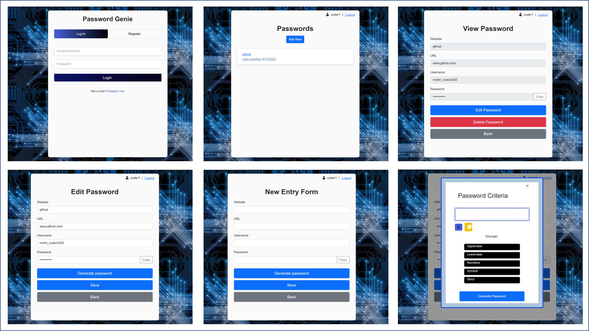
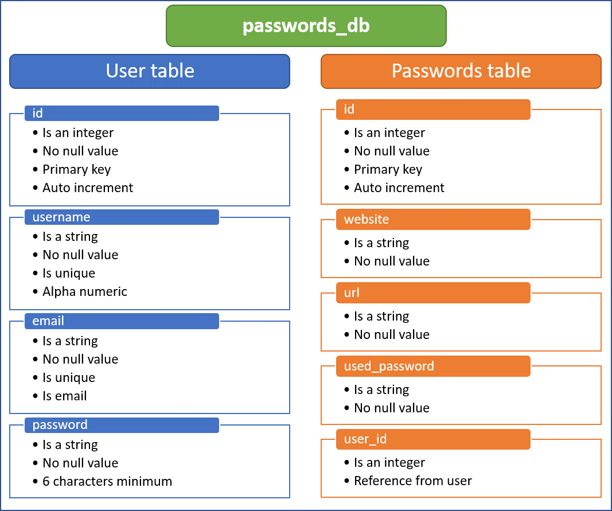

<h1 align="center">👋 Password-genie 👋</h1>

<p align="center">
    
    
    
    
</p>

<p align="center">
    
    
</p>
  
<p align="center">
    
    
    
    
    
    
    
    
    
    
       
</p>

## Description of the application
Creating a simple, secure and responsive application that allows a users to generate an store passwords for their every registered account.

<h2>Table of contents</h2>

- [Description of the application](#description-of-the-application)
- [User story](#user-story)
- [Acceptance criteria](#acceptance-criteria)
- [Contributors](#contributors)
- [Team work](#team-work)
- [Packages](#packages)
- [Models](#models)
- [Associations](#associations)
- [Future developments](#future-developments)
- [Presentation link:](#presentation-link)
- [Repo link:](#repo-link)
- [HEROKU Deployed link:](#heroku-deployed-link)
- [Wireframe](#wireframe)
- [Screenshots - Schema](#screenshots---schema)

## User story
``` 
AS A busy professional who manages many systems with different password requirements
I want a simple and secure Password Management System that ALLOWS me to generate and store different passwords,
SO THAT I can access them when required for every registered account.
``` 

## Acceptance criteria
``` 
GIVEN I do not have an account in the password genie app
WHEN I click register THEN I am presented with a form AND I need to enter a username, email and password
WHEN I enter an exisitng user email to register THEN I am presented with an error message to notify me that the username has been taken
WHEN I submit the form with a unique email THEN I am taken to the user dashboard
 
GIVEN I have an account in the password genie app 
WHEN I enter registered username and password THEN I am taken to the user dashboard

GIVEN I have an account in the password genie app
WHEN log in THEN I am presented with a dashboard
AND I have the option to create a new item, view an exisitng item, edit an existing item and delete an existing item.

GIVEN I have logged in to the password genie app,
WHEN I choose to create a new item THEN I am presented with a form.
AND I need to enter a website name, url of website, username and type a password or generate a password using a modal with different user requirement.
WHEN I submit the form THEN I am taken back to the dashboard and I can see my newly created item.
WHEN I choose to edit an existing item THEN I am presented with a pre-filled form with existing data
AND I can edit the website name, url of website, username and type or generate a new password using a modal with different user requirement
WHEN I submit the form THEN I am taken back to the dashboard and I can see my updated password item.
WHEN I choose to delete an existing item THEN the password item is removed from the dashboard.
```
## Contributors
1. [Diana Keosswanto](https://github.com/dianakoeswanto)
2. [Mohit Arora](https://github.com/marora7926)
3. [Nadja Antonjak](https://github.com/nadjaantonjak)
4. [Tim Rabbidge](https://github.com/TBR2000)
   
## Team work
```
The strong teamwork between our group is what motivated everyone in the group throughout the whole of Project-2. Being supportive of one another and learning from each other was an extremely rewarding part of this project. We could rely on each other and always knew that if we did not understand a particular thing or needed guidance that we were not alone and could depend on each other.
```

## Packages
  * [bcrypt](https://www.npmjs.com/package/bcrypt)
  * [connect-session-sequelize](https://www.npmjs.com/package/connect-session-sequelize)
  * [cryptr](https://github.com/MauriceButler/cryptr)
  * [dotenv](https://www.npmjs.com/package/dotenv)
  * [express](https://www.npmjs.com/package/express)
  * [express-handlebars](https://www.npmjs.com/package/express-handlebars)
  * [express-session](https://www.npmjs.com/package/express-session)
  * [generate-password](https://github.com/brendanashworth/generate-password)
  * [handlebars](https://www.npmjs.com/package/handlebars)
  * [mysql2](https://www.npmjs.com/package/mysql2)
  * [sequelize](https://www.npmjs.com/package/sequelize)
  * [shield-io](https://shields.io/)

## Models
The application is based on one `passwords_db` database containing two tables namely `user` and `passwords`. See [schema](#screenshots---schema) here.

## Associations
* `Passwords` belongs to a `User`, and a `User` has many `Password` models, as a user can have multiple passwords but a password can only belong to one user.

## Future developments
  1. Add a button on the landing page "forgot my password" which will send a temporary password recovery link to user's email.
  2. App will notify the user that password has not been changed for more than 6 months. 
  3. Automatic notification will be sent to users registered email.
  4. Users inputs will be validated.
  5. Allow user to search a password on the dashboard.
  6. Finding a more secure way to encrypting the database.
  7. Add a reveal icon to display the password.
  8. URL click will direct to the website and auto-fill username and password.


## Presentation link:
[👋 Password-genie Presentation 👋](https://cloudstor.aarnet.edu.au/plus/s/kbKe2OGZ0js3jDp)

## Repo link:
[👋 Password-genie Repo 👋](https://github.com/marora7926/password-genie)

## HEROKU Deployed link:
[🎥 Password-genie Application 🎥](https://password-genie.herokuapp.com)

## Wireframe


## Screenshots - Schema

- - -
© 2021 Bootcamp students. Confidential and Proprietary. All Rights Reserved